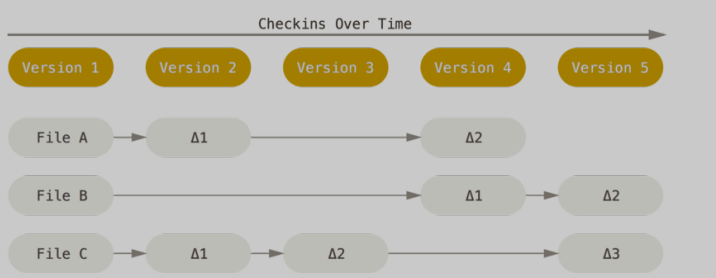
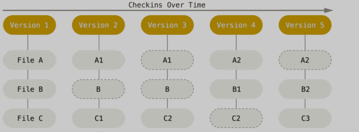

# 起步
## 目标
- 速度
- 简单
- 非线性开发支持
- 分布式
- 超大项目支持

## 特点
### 版本控制机制
- 其他控制工具：记录文件不同版本的差异

- git：通过快照方式保持数据

其中，无变化的文件存储的是上一版本的文件的引用

### 基于本地的处理
由于多数操作无需访问远程库
- 速度极快
- 可脱机工作
- 本地库存有历史

### 保证完整性
通过SHA-1算法对文件内容进行哈希计算、校验，避免传输过程丢失、损坏

### 一般添加数据
多数操作均以添加数据的方式提交到git数据库，很难执行不可逆操作或清除数据，避免数据丢失

### 三个工作区域
- 工作目录、暂存区、git仓库
- 流程：在工作区编辑文件，提交暂存区生成快照，提交到git仓库对快照永久保存

## 安装
略

