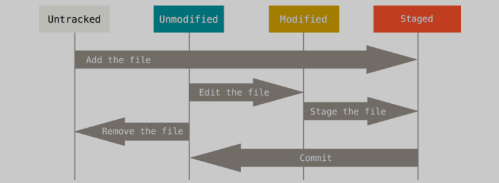

# 基础
## 获取git仓库
### 本地初始化仓库
- git init：初始化仓库，默认当前目录
```
git init
```
也可以指定目录
```
git init fileName
```

### 元辰克隆仓库
- git clone：远程克隆，将远程库拉取至当前目录
```
git clone https://github.com/mihumouse/tool-chain.git
```
也可指定目标目录
```
git clone https://github.com/mihumouse/tool-chain.git path
```

## 状态
### 文件状态
文件分为未被跟踪、未修改、已修改、已缓存等状态，变化规律如下   


### 查询状态
git status，可查看是否有文件在以上的文件状态下，以便于开发者了解状态和处理   
-s参数能够简化status的冗长描述
```
$ git status -s     
 M README.md
AM notes/01Start.md
AM notes/02Basic.md
A  test.md
?? notes/pic/
```
- 执行后M为修改，A为新增   
- AM代表即在缓存区add了，后又进行了修改   
- ??代表新增为被跟踪

## 跟踪
新建文件后，文件默认状态是untracked，需要通过git add，开始对该文件跟踪
```
git add test.md
```

## 查看未提交至缓存的内容
git diff，可查询尚未暂存的改动，如已经git add . 则diff后无任何返回

## 提交暂存信息
- git commit：提交到本地仓库
```
git commit -m "commit test"
```

## 移除文件
git rm ：将文件从暂存区和工作区中删除
```
git rm -f file
```
删除之前修改过并且已经放到暂存区域的话，则必须要用强制删除选项 -f，目录递归 -r，如果只删除暂存区，不删除工作区则--cached

## 移动文件、修改文件名
git vm 进行文件移动和修改
```
git mv test/text test/text.md
```

## 撤销提交
### git commit --amend   
当commit后发现提交描述信息错了，亦或有文件遗漏，则通过--amend进行调整，详细又分两种情形：
- 如果commit后直接执行git commit --amend则可修改提交的描述信息
- 如果commit后，又进行了部分add等操作，再git commit --amend，则将后续的操作与上次提交合并为一次提交
```
echo 'test1' >> test1.md
git add test1.md
git commit -m 'first commit'
echo 'test1' >> test2.md
git add test2.md
git commit --amend -m 'test amend commit'
```
如上test1.md与test2.md合并在一次commit

### git reset HEAD <file>
如果想取消已commit到暂存区的文件，将文件恢复成修改未暂存状态，且工作区已修改内容无变化
```
git reset HEAD test2.md
```

### git checkout -- <file>
如果想取消工作区已经修改单未提交到暂存区的文件，且不再需要已修改的版本
```
git checkout -- test2.md
```
注：执行后工作区修改直接覆盖

## 远程仓库
### 查看已配置的远程仓库
git remote：查看已经配置的远程仓库，如果已经克隆一个仓库，则会看到origin（git默认命名为origin）

### 添加、推送到远程仓库
git remote add <shortName> <url>：将本地仓库代码添加到远程仓库
git push -u <remoteName> <branch>：push到远程（注：如果是clone下来到本地库的，后面的参数git会自动设置为克隆源的名称）

### 几种拉取方式
- git clone <url>：自动添加远程仓库，并默认简称为origin
- git fetch <remoteName>：抓取上一次抓取后的新增的所有内容，拉取到本地仓库，但不会自动合并，需要手动合并   
- git pull <url> <remoteBranch>：<localBranch>：pull相当于fetch + merge

## 打标签
- git tag：给版本打tag
```
弹出窗口写注释
git tag -a v0.1
直接写注释
git tag v0.1 -m 'xxx tag'
```
- git tag：查看有哪些tag
- git tag -d v0.1：删除tag